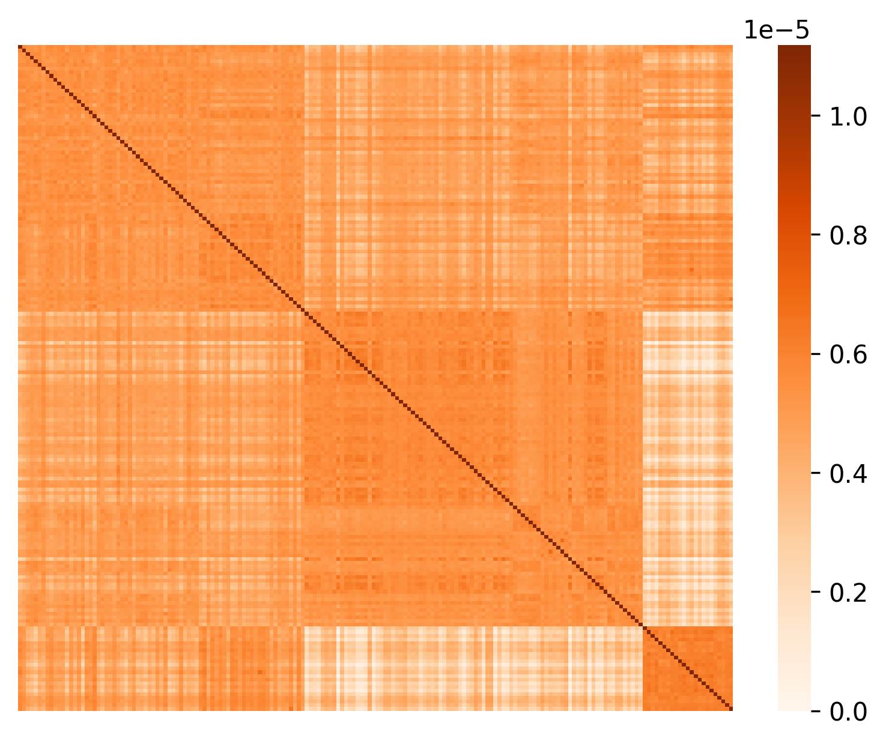
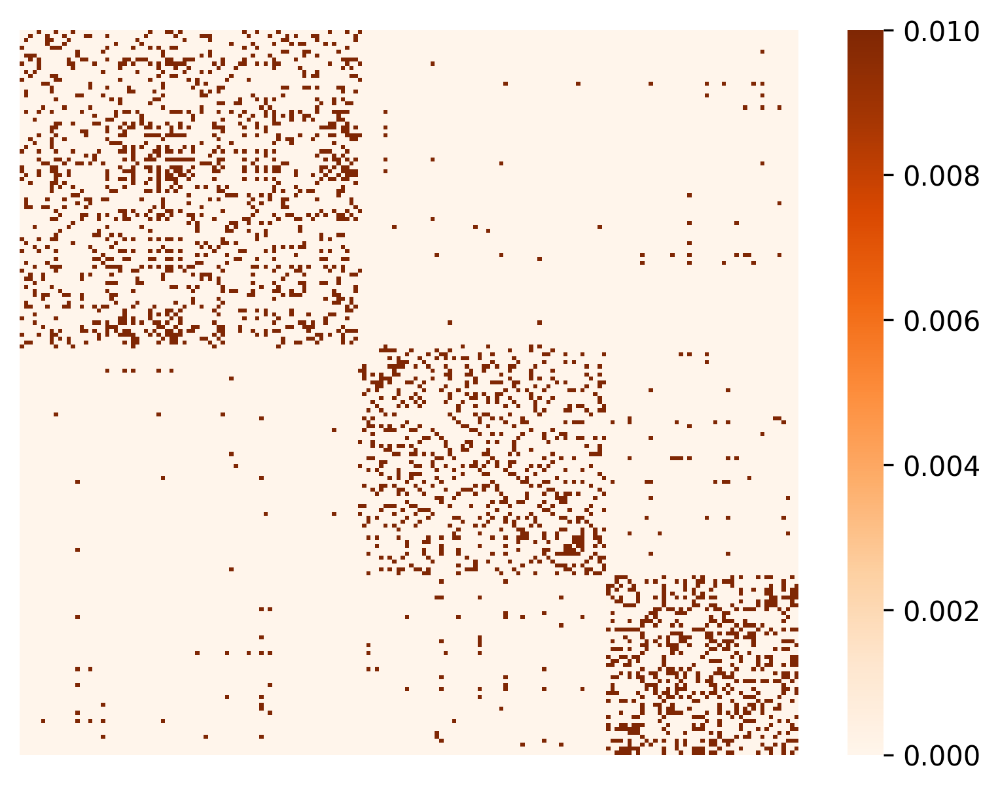
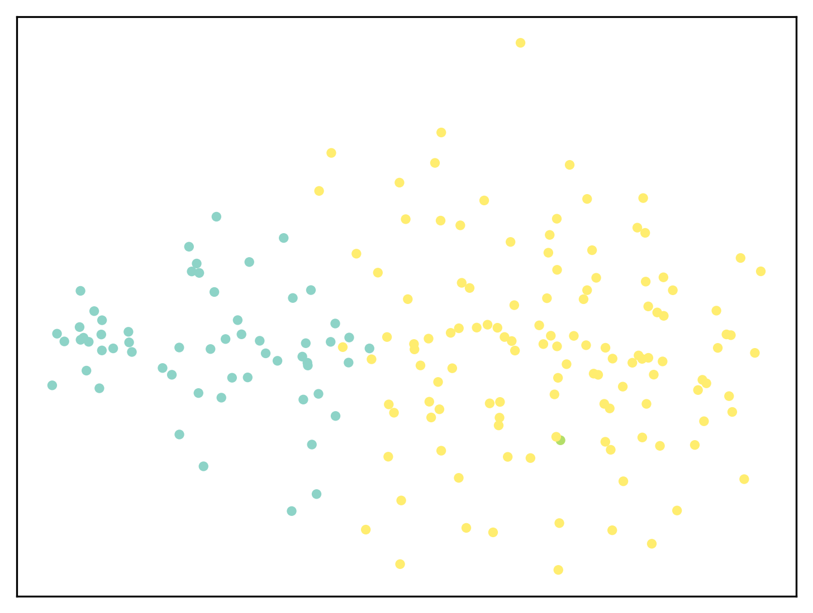
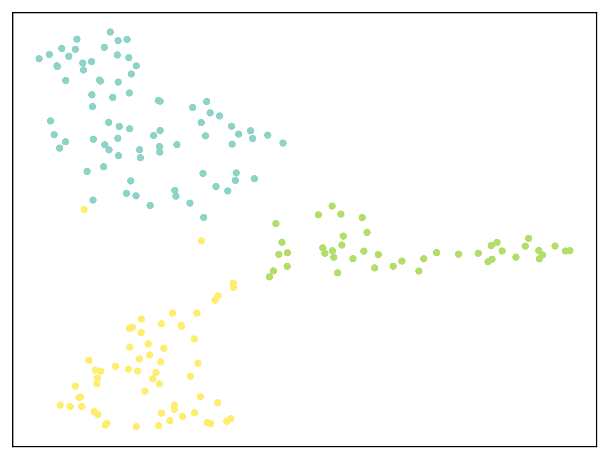
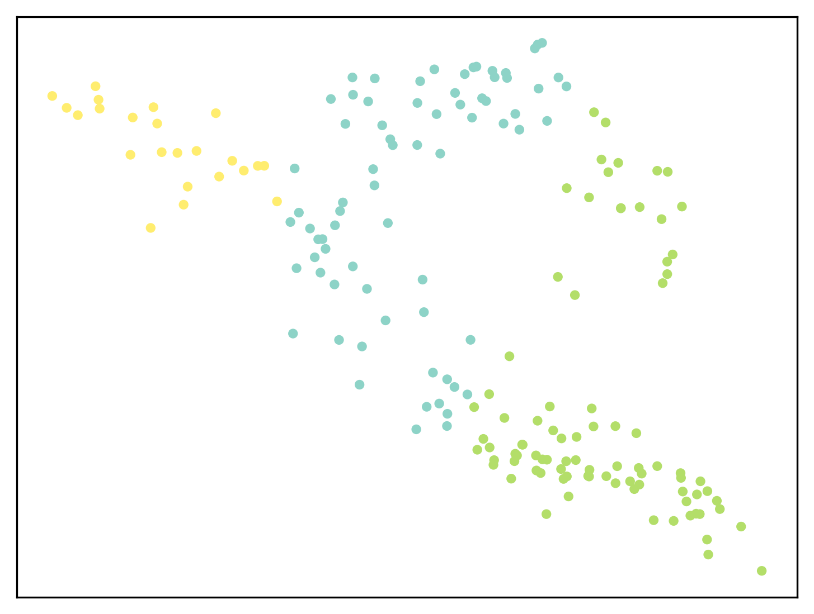
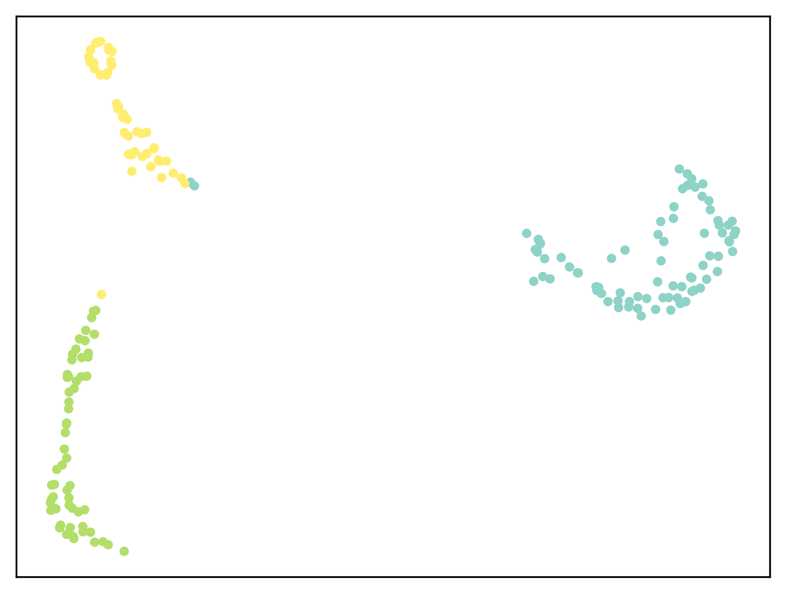

# Clustering Alzheimer’s Disease Subtypes via Similarity Learning and Graph Diffusion

This repository holds the source code for the paper:
> Tianyi Wei; Shu Yang; Davoud Ataee Tarzanagh; Jingxuan Bao; Jia Xu; Patryk Orzechowski; Joost B. Wagenaar; Qi Long; Li Shen. Clustering Alzheimer’s Disease Subtypes via Similarity Learning and Graph Diffusion.

## 🦸‍ Abstract
Alzheimer's disease (AD) is a complex neurodegenerative disorder that affects millions of people worldwide. Due to the heterogeneous nature of AD, its diagnosis and treatment pose critical challenges. Consequently, there is a growing research interest in identifying homogeneous AD subtypes that can assist in addressing these challenges in recent years. In this study, we aim to identify subtypes of AD that represent distinctive clinical features and underlying pathology by utilizing unsupervised clustering with graph diffusion and similarity learning. We adopted SIMLR, a multi-kernel similarity learning framework, and graph diffusion to perform clustering on a group of 829 patients with AD and mild cognitive impairment (MCI, a prodromal stage of AD) based on their cortical thickness measurements extracted from magnetic resonance imaging (MRI) scans. Although the clustering approach we utilized has not been explored for the task of AD subtyping before, it demonstrated significantly better performance than several commonly used clustering methods. Specifically, we showed the power of graph diffusion in reducing the effects of noise in the subtype detection. Our results revealed five subtypes that differed remarkably in their biomarkers, cognitive status, and some other clinical features. To evaluate the resultant subtypes further, a genetic association study was carried out and successfully identified potential genetic underpinnings of different AD subtypes.


## 📝 Requirements
- Python 3.6 or later
- MATLAB
  
Install the required packages using pip:
```
pip install -r requirements.txt
```

## :file_cabinet: Data
The data used in the paper is a subset of the Alzheimer's Disease Neuroimaging Initiative (ADNI) dataset. We are unable to provide the data used for this paper due to the presence of a nondisclosure agreement (NDA) that governs its use. The data contains sensitive or proprietary information that is subject to legal restrictions.

We understand the importance of transparency and reproducibility in research and development. While we are unable to share the actual dataset, we have provided the scripts and instructions needed to generate figures using a single-cell RNA-seq dataset (mECS) <sup id="footnote1">1</sup> made to the public by the authors of SIMLR <sup id="footnote2">2</sup>, so you can understand the methodology and visualization techniques applied. This dataset contains 182 cells from 3 distinct cell populations. The data is stored in the "**MATLAB/data**" directory as "**Test_1_mECS.mat**".


## 🔨 Usage
### Clone this repository
Clone this repository to your local machine:
```
git clone 
cd AD-SIMLR/MATLAB
```
The authors of SIMLR provided SIMLR code for R and MATLAB. We conducted our analysis using the MATLAB version of SIMLR.

### Generate Clustering Results
The "SC_SIMLR_implementation.m" script contains code to generate Silhouette scores, similarity matrices, cluster assignments, and 2D visualization embeddings.
1. Open MATLAB on your machine.

2. Navigate to the directory containing the `SC_SIMLR_implementation.m` script.
   ```
   /path/to/repo/AD-SIMLR/MATLAB
   ```
   
3. Make sure you have the data in the "data" directory and specify the correct path in the script
   ```
   data_path = "data/Test_1_mECS.mat";
   ```
   
4. Run the script in MATLAB

We modified the implementation in "**SIMLR.m**" to generate results before and after applying graph diffusion. 

### Generate Visualizations
The "**generate_figures.py**" script generates figures of similarity matrices and 2-D cluster visualization using data obtained from the MATLAB script. We used this script to generate Figure 3 and Figure 4 in the paper. 
```
python generate_figures.py --dir ./results
```

### Results
We applied K-Means, spectral clustering, SIMLR, and the graph diffusion variants of the latter two methods to the mECS dataset. The Silhouette scores are stored in "**./results/silhouette_scores.csv**". We observed that the highest Silhouette score was achieved by SIMLR with graph diffusion. 
|       | kmeans | SC       | SC w/ diffusion  | SIMLR    | SIMLR w/ diffusion |
|-------|--------|----------|------------------|----------|--------------------|
| Value | 0.0566 | 0.7413   | 0.8723           | 0.5740   | 0.9835             |
abbreviation: SC - spectral clustering

Below are the heatmaps of similarity matrices for spectral clustering, SIMLR, and their graph diffusion variants. All four similarity matrices have a block-diagonal structure. However, the similarity matrices of spectral clustering and SIMLR without graph diffusion suffered from a large amount of noise in the off diagonal entries (Figure 3a, 3b). After adding the graph diffusion, the noise in the similarity matrices were largely reduced (Figure 3c, 3d). The noise reduction effect of graph diffusion is especially remarkable under the similarity learning framework.

|  |  |
|:---:|:---:|
| *Spectral Clustering* | *SIMLR* |
|  |  |
| *Spectral Clustering  + Graph Diffusion* | *SIMLR  + Graph Diffusion* |

Below are the 2-D cluster visualizations for each of the five methods. The 2-D embeddings were obtained using t-SNE. We observed that SIMLR with graph diffusion resulted in the most well-separated visualization for the clusters. 

|  |  |
|:---:|:---:|
| *K-Means* | *SC* |
|  |  |
| *SIMLR* | *Spectral Clustering  + Graph Diffusion* |
|:---:|
| <center></center> |
| <center>*SIMLR + Graph Diffusion*</center>|


## 🤝 Acknowledgements


### 📚 Citation
[1] Buettner, F. et al. Nat. Biotechnol. 33, 155–160 (2015).
[2] Wang B, Zhu J, Pierson E, Ramazzotti D, Batzoglou S. Visualization and analysis of single-cell RNA-seq data by kernel-based similarity learning. Nature methods. 2017;14(4):414-6.


   
